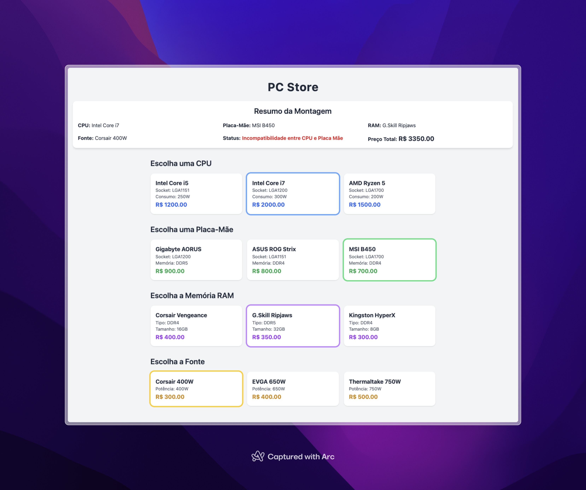

# 🖥️ Montador de Computadores - Desafio Java

Este projeto foi desenvolvido como parte de um desafio em sala de aula, com o objetivo de praticar **herança, composição** e o uso de **enums** em Java. O sistema simula a montagem de um computador, permitindo que o usuário selecione componentes e verifique sua compatibilidade.

---

## 🎯 Objetivo

Criar um sistema orientado a objetos que simula a montagem de um computador com os seguintes componentes:

- **CPU**
- **Placa-Mãe**
- **Memória RAM**
- **Fonte de Alimentação**

---

## 🧱 Estrutura do Sistema

### 🔹 Classe Base: `Componente`

Classe abstrata que representa qualquer componente de hardware. Contém atributos comuns:

- `Long id`
- `String nome`
- `int consumo` (em watts)
- `double preco`

---

### 🔸 Classes Específicas

#### ✅ CPU
- Atributo: `Socket socket`
- Herdado de `Componente`

#### ✅ Placa-Mãe
- Atributos: `Socket socket`, `TipoMemoria tipoMemoria`
- Métodos:
  - `boolean compativel(Cpu cpu)`
  - `boolean compativel(Ram ram)`

#### ✅ RAM
- Atributos: `TipoMemoria tipo`, `int tamanhoGb`
- Herdado de `Componente`

#### ✅ Fonte
- Atributo: `int potencia`
- Herdado de `Componente`

---

### 🧩 Enums

- `Socket`: `LGA1151`, `LGA1200`, `LGA1700`
- `TipoMemoria`: `DDR4`, `DDR5`

---

### 🖥️ Classe Principal: `Computador`

Representa o computador montado com os seguintes métodos:

- `String status()`: Verifica compatibilidades e retorna o status do sistema.
- `double precoTotal()`: Retorna o valor total dos componentes instalados.

---

## 📷 Preview



---

## 🚀 Como rodar o projeto

1. Clone o repositório:

```bash
git clone https://github.com/NicolasRAlves/montador-computador-java.git
```

2. Importe o projeto na sua IDE Java (IntelliJ, Eclipse, VS Code, etc).

3. Compile e execute a classe Main (ou equivalente) para testar o sistema.

---

## 📚 Conceitos aplicados

- Herança e classes abstratas
- Composição entre objetos
- Enums e validação de compatibilidade
- Encapsulamento e boas práticas de modelagem OO

---

## 🙌 Agradecimentos

Este projeto foi desenvolvido como parte de um desafio proposto em sala de aula pelo professor **João Carlos Lima** ([joaocarloslima](https://github.com/joaocarloslima)).

Agradecimentos pela proposta desafiadora e prática, que nos permitiu aplicar os conceitos de herança, composição e enums em Java de forma concreta e didática.
